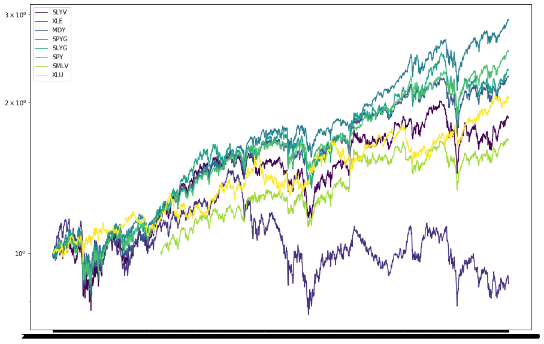
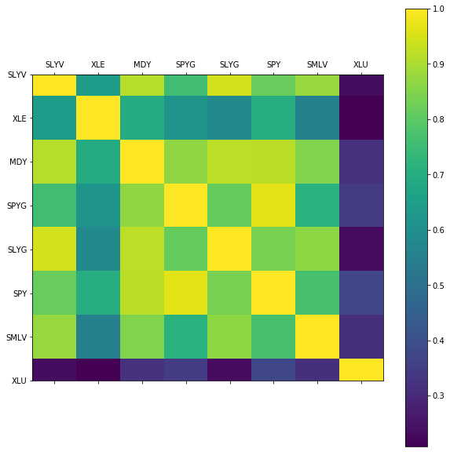
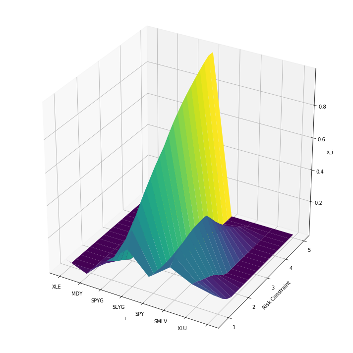
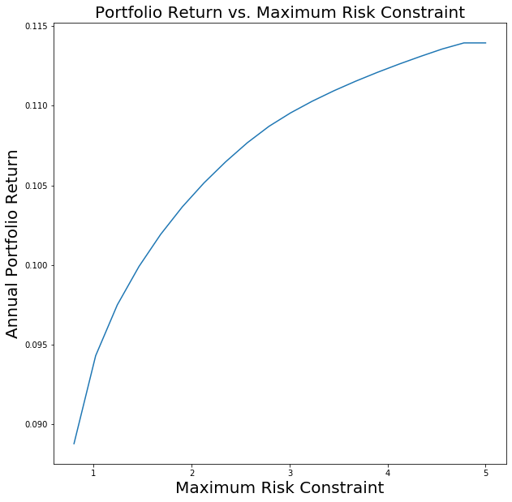

# Portfolio Optimization

Stuart Truax, 2020-07

This notebook demonstrates the use of modern portfolio theory in optimizing a
portfolio of equity securities. Price series data of several equities are compiled
and interday returns for the securities are compiled, along with the covariance matrix.

Several portfolios are generated based on the following quadratic programming problems:

 - __Minimized Risk, Long-only Positions__
 - __Maximized Return with Regularized Risk, Long-only Positions__
 - __Maximized Return with Constrained Risk, Long-only Positions__
 - __Calculating the Efficient Frontier__

## Example Visualizations from the Analyses

### Price Series Data

### Correlation Matrix

### Surface Plot of Portfolio Weights as a Function of Maximum Risk Constraint

### Efficient Frontier

## Requirements

 - `python 3.6`
 - `cvxpy`
